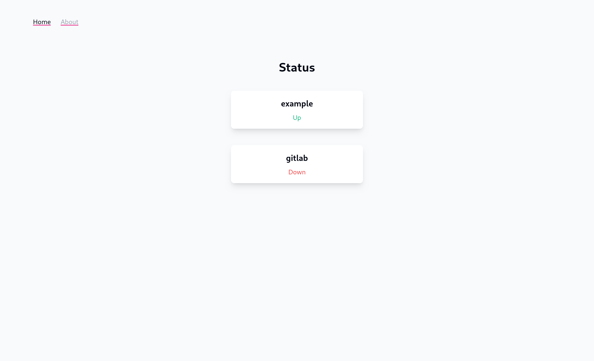

# Status
Status is a minimalist status tools

<p style="text-align: center;">
  <picture>
    <source media="(prefers-color-scheme: dark)" srcset="doc/assets/home-dark.png">
    
  </picture>
</p>

## Features :

- Simple status page
- An api (not documented yet)
- Alert on discord when a host is down

# Building
## Dependencies
First, you'll need Go (>1.22), pnpm, make. The second step is to install front dependencies :

```bash
cd front/
pnpm install
```

## Build
```bash
make build
```

or

```bash
make
```

The second build *and* run directly the binary.

Using docker is also possible. You can build the image with the follow command :

```bash
docker build . -f deployment/docker/Dockerfile -t status
```


# Configuration
You can find a documented example in `config.example.toml`

# Run
After having compiled, you can simply run `./status <config path>`. If no argument is provided, the config will be `./config.toml`

With docker : `docker run -v ./config.toml:/config.toml -p 3000:3000 ghcr.io/r4iponce/status:dev`